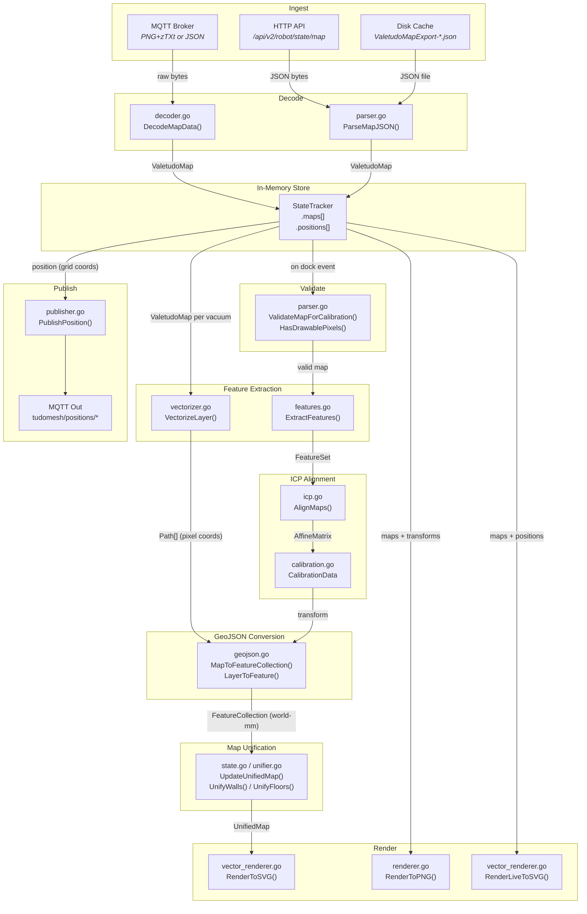
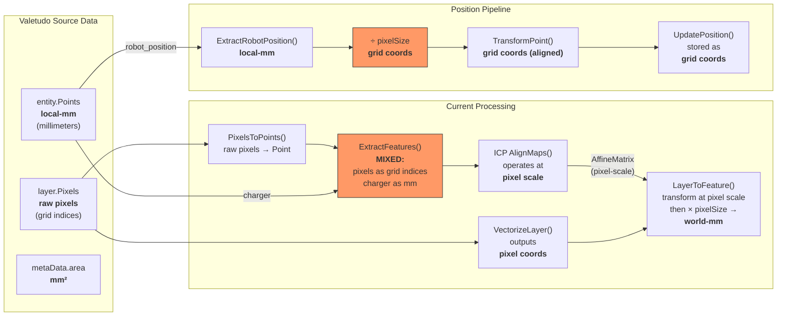
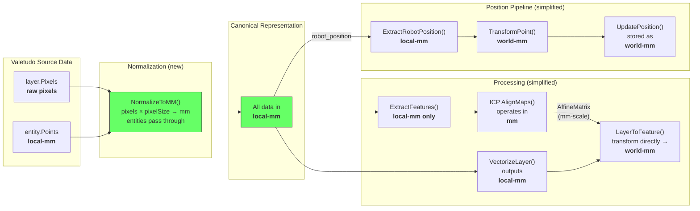

# tudomesh Data Pipeline & Coordinate Systems

## Overview

tudomesh ingests vacuum robot map data from two sources (MQTT and HTTP API),
aligns multiple vacuums via ICP, and renders composite maps. This document
describes each processing stage and the coordinate system in use at each point.

## Coordinate System Definitions

| Term | Units | Description |
|------|-------|-------------|
| **raw pixels** | grid indices (unitless) | Indices into the Valetudo pixel grid. `layer.Pixels = [x1,y1,x2,y2,...]` |
| **local-mm** | millimeters | Per-vacuum coordinate space. `entity.Points` are natively in local-mm. Pixel indices convert via `mm = index * pixelSize`. Not yet aligned with other vacuums. |
| **world-mm** | millimeters | Shared coordinate space after ICP alignment. `world = transform(local)` where transform is the ICP-computed AffineMatrix. |

## Current-State Pipeline

## Coordinate Flow Detail

> **Red nodes** indicate coordinate mismatches or unnecessary conversions in the current implementation.

### Current Issues

1. **Mixed coordinates in ExtractFeatures()**: `PixelsToPoints()` returns grid
   indices while `ExtractChargerPosition()` returns mm. Both are stored in the
   same `FeatureSet` and fed to ICP together.

2. **Position converted to grid then back**: Robot position arrives in mm
   (`entity.Points`), gets divided by `pixelSize` to grid coords, ICP
   transforms at grid scale, then the renderer multiplies back by `pixelSize`
   for display.

3. **ICP transform is pixel-scale**: The `AffineMatrix` from ICP encodes
   translation in grid units. Every consumer must remember to scale by
   `pixelSize` after applying the transform.

4. **VectorizeLayer outputs pixel coords**: Contour tracing works in grid
   space. `LayerToFeature` applies the ICP transform at pixel scale, then
   scales to mm — a two-step conversion at every render.

## Target-State Pipeline (after tudomesh-9uo)

### Key Changes

1. **Single normalization point**: All data converted to local-mm immediately
   on ingest. No mixed coordinate systems downstream.

2. **ICP in mm**: The `AffineMatrix` from ICP encodes translation in mm.
   Consumers apply transforms directly without scaling.

3. **Entity-first validation**: `ValidateMapForCalibration()` accepts maps
   with entity path points even when `layer.Pixels` is empty (Valetudo API
   now returns empty pixels in some states).

4. **Positions stay in mm**: No grid conversion. `local-mm → ICP transform → world-mm` is the only path.

## Pipeline Relationship: ICP vs GeoJSON

ICP and GeoJSON are **independent pipelines** that both consume pixel data separately.
GeoJSON is NOT used to drive ICP alignment — they serve different purposes:

- **ICP/features** (`features.go`): Point cloud alignment — finds the transform.
  `layer.Pixels → PixelsToPoints() → ExtractFeatures() → AlignMaps() → AffineMatrix`

- **GeoJSON/vectorizer** (`vectorizer.go`, `geojson.go`): Geometry conversion —
  applies the transform to produce polygons/linestrings for unified map rendering.
  `layer.Pixels → VectorizeLayer() → LayerToFeature(transform) → FeatureCollection`

Both independently process `layer.Pixels`, which means both break when pixels are
empty. After the mm refactor, entity path points (already vector data in mm) may
reduce the vectorizer's role for maps that lack pixel data.

## File Reference

| File | Role | Current Coords | Target Coords |
|------|------|---------------|---------------|
| `mesh/decoder.go` | MQTT payload decode | raw bytes → ValetudoMap | unchanged |
| `mesh/parser.go` | JSON parse, validation | grid indices + mm (mixed) | local-mm only |
| `mesh/types.go` | Data structures | Pixels: grid indices | Pixels: mm (or add CompressedPixels) |
| `mesh/features.go` | ICP feature extraction | grid indices (+ charger mm) | local-mm |
| `mesh/icp.go` | ICP alignment | pixel scale | mm scale |
| `mesh/vectorizer.go` | Contour tracing | grid → pixel coords | grid → local-mm |
| `mesh/geojson.go` | GeoJSON conversion | pixel → transform → ×pixelSize → world-mm | local-mm → transform → world-mm |
| `mesh/vector_renderer.go` | SVG rendering | pixel → ×pixelSize → world-mm | world-mm direct |
| `mesh/renderer.go` | PNG rendering | grid coords | world-mm |
| `mesh/state.go` | Map + position store | positions in grid coords | positions in mm |
| `mesh/publisher.go` | MQTT position publish | grid coords | world-mm |
| `mesh/calibration.go` | Transform persistence | pixel-scale AffineMatrix | mm-scale AffineMatrix |
| `app.go` | Orchestration | mm → ÷pixelSize → grid → transform | mm → transform → world-mm |
